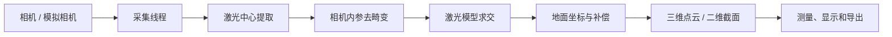

# 0704 线激光三维截面实时测量工具

本仓库是 0704 线激光三维截面测量系统的第一阶段工程，当前重点是：

- 海康 MVS、大恒 Galaxy USB3 相机或模拟相机实时取流；
- 线激光中心提取（`centroid`、`steger`、`shared_steger`）；
- 相机坐标、激光模型和地面坐标之间的三维恢复；
- 实时三维点云、二维 `Xg-Zg` 截面和障碍物高度测量；
- 单帧区域选择、点云/CSV/图像/JSON 导出和定长录制；
- 标定配置、硬件 ROI 和结果元数据的可追溯管理。

> 当前版本是可运行的第一阶段实时测量工具。正式计量使用前，必须使用与实际相机、镜头、激光器、安装姿态、曝光和 ROI 完全匹配的标定数据完成独立验证。

## 文档入口

| 文档 | 内容 |
|---|---|
| [在线实时工具用户手册](laser_measurement_tool/docs/ONLINE_USER_MANUAL.md) | 安装启动、界面操作、相机参数、曝光/ROI、FPS、单帧测量、标定配置、导出和故障排查 |
| [实时工具模块说明](laser_measurement_tool/README.md) | 实时处理模块、配置字段、测试和开发说明 |
| [海康 0829 三段人工 ROI 冻结](laser_measurement_tool/docs/HAIKANG_0829_MANUAL_ROI_ANNOTATION.md) | 50 个 condition 的 geometry-only 代表视图、人工选择、续标与冻结输出 |
| [海康 0829 冻结人工 ROI C0 重放](laser_measurement_tool/docs/HAIKANG_0829_MANUAL_ROI_C0_REPLAY.md) | 使用冻结 ROI 绕过自动 target detection 的 C0 + Session Ground 诊断重放 |
| [海康 0829 H1 可行性审计](laser_measurement_tool/docs/HAIKANG_0829_H1_FEASIBILITY.md) | condition-level LOHO、端点外推和 LOPO 的 H1 feasibility 诊断 |
| [仓库目录职责与整理约定](docs/REPOSITORY_STRUCTURE.md) | 每个目录放什么、主线/历史/产物边界、实验结果归档与清理规则 |
| [标定工具仓库](https://github.com/1visio/calibration_tool) | 相机内参、外参、激光模型和地面补偿配置的生成与验证 |

第一次使用时请先阅读[在线实时工具用户手册](laser_measurement_tool/docs/ONLINE_USER_MANUAL.md)，不要直接根据旧工程文档配置真实设备。

## 快速启动

### 1. 创建环境并安装依赖

在仓库根目录执行 PowerShell 命令：

```powershell
cd D:\Docs\linelaserscan\0704line-laser-3d-scanner
py -3.11 -m venv .venv
.\.venv\Scripts\python.exe -m pip install -r .\laser_measurement_tool\requirements.txt
```

真实相机还需要安装对应厂商 SDK，并确保 Python 绑定和运行库可用。没有相机时可以先使用模拟模式检查界面和线程链路。

大恒 USB3 相机使用 Galaxy SDK 随附的 `gxipy` Python wrapper。启动时增加
`--camera-backend daheng`；程序会从 `C:\Program Files\Daheng Imaging\GalaxySDK`
或 `DAHENG_GALAXY_ROOT` 加载 SDK。大恒相机必须使用与实际相机、镜头和安装姿态匹配的独立标定数据，不能直接复用海康标定。

### 2. 使用模拟相机

```powershell
.\.venv\Scripts\python.exe .\laser_measurement_tool\online_camera.py --simulate
```

模拟模式可以验证窗口、实时状态、录制和导出流程，但不能代表真实相机的曝光、传输性能或测量精度。

### 3. 连接真实相机

```powershell
.\.venv\Scripts\python.exe .\laser_measurement_tool\online_camera.py
```

大恒 Galaxy USB3：

```powershell
.\.venv\Scripts\python.exe .\laser_measurement_tool\online_camera.py `
  --camera-backend daheng
```

默认读取 `laser_measurement_tool/configs/measure_tool.yaml`。也可以显式指定配置和提取算法：

```powershell
.\.venv\Scripts\python.exe .\laser_measurement_tool\online_camera.py `
  --config .\laser_measurement_tool\configs\measure_tool.yaml `
  --method steger
```

## 当前默认采集参数

| 参数 | 默认值 | 说明 |
|---|---:|---|
| 像素格式 | `Mono8` | 必须与标定和验证数据保持一致 |
| 曝光 | `600 μs` | 停流后应用；正式测量应记录并固定 |
| 增益 | `0 dB` | 建议优先通过曝光和光学条件改善信噪比 |
| Offset X | `0` | 硬件 ROI 横向偏移 |
| Offset Y | `880` | 硬件 ROI 纵向偏移 |
| 宽度 | `2448` | 当前硬件 ROI 宽度 |
| 高度 | `300` | 当前硬件 ROI 高度 |
| 提取算法 | `steger` | 当前实时链路推荐算法 |

修改像素格式、Offset、宽度或高度前必须停止取流，并确认对应标定文件仍然有效。硬件 ROI 图像的保存结果会附带 JSON sidecar，用于记录 ROI 偏移并支持后续单帧测量坐标还原。

## 实时处理链路



实时状态中的 `采集 fps`、`处理 fps`、`显示 fps` 和 `丢帧/覆盖` 含义不同。判断处理能力时优先看处理 fps、单帧耗时和丢帧计数，详细解释见[用户手册的 FPS 章节](laser_measurement_tool/docs/ONLINE_USER_MANUAL.md#5-fps处理耗时与丢帧解释)。

## 主要操作

1. 点击“刷新”发现相机，选择设备后点击“连接”；
2. 停流状态下确认像素格式、曝光、增益和硬件 ROI；
3. 点击“开始”，确认状态为“取流中”；
4. 在“原始图像”和“激光中心提取”视图检查激光线连续性；
5. 使用“保存当前帧”保存原图和 JSON sidecar；
6. 使用“导出当前点云/CSV”保存当前帧结果；
7. 使用“单帧测量与区域选择”添加地面基准区和障碍物区；
8. 需要采集数据集时使用“定长录制”；
9. 结束时先点击“停止”，再点击“断开”。

完整按钮说明、区域选择规则、测量阈值和异常处理请以[在线实时工具用户手册](laser_measurement_tool/docs/ONLINE_USER_MANUAL.md)为准。

## 配置与标定

实时工具默认使用：

```text
laser_measurement_tool/configs/measure_tool.yaml
laser_measurement_tool/configs/calibration/manifest.yaml
```

标定 manifest 会关联相机内参、相机到地面外参、激光模型、地面补偿和文件哈希。替换标定文件后，应重新检查 manifest，并用固定验证图像确认：

- 激光中心位置和有效点比例；
- 地面 `Zg` 基准和噪声；
- 已知障碍物高度；
- ROI 偏移、图像坐标和三维坐标方向；
- 与当前提取算法、曝光和像素格式的一致性。

标定配置的字段说明和替换流程见[用户手册的标定配置章节](laser_measurement_tool/docs/ONLINE_USER_MANUAL.md#8-标定配置与修改)。不要把旧设备的内参、激光平面、地面外参或 ROI 直接用于新设备。

## 输出目录

实时运行产生的文件默认位于：

```text
laser_measurement_tool/output/online_measurements/
laser_measurement_tool/output/online_recordings/
```

典型结果包括：

- `laser_center.csv`：逐列激光中心；
- `full_points.csv`：像素、相机坐标和地面坐标对应关系；
- `full_laser_ground.ply`：地面坐标系点云，单位为 mm；
- `overlay.png`：激光中心叠加图；
- `result.json`：帧信息、算法、标定包 ID/哈希和过滤统计；
- 图像文件及其 JSON sidecar：包含硬件 ROI 偏移、帧号和时间戳。

不同标定版本或不同算法产生的结果不要混放在同一个实验目录中。

## 目录结构

```text
laser_measurement_tool/
├─ online_camera.py             实时工具入口
├─ main.py                      单帧测量 GUI
├─ scan_offline.py              Stage-1 离线扫描入口
├─ online/                      相机、队列、处理和录制运行时
├─ gui/                         在线窗口、图像和点云视图
├─ laser/                       激光中心提取后端
├─ reconstruction/              三维恢复和地面坐标转换
├─ measurement/                 单帧区域和高度测量
├─ scan/                        扫描运动学和点云累积
├─ visualization/               可视化辅助
├─ utils/                       图像与元数据 I/O
├─ configs/                     测量参数和标定 manifest
├─ docs/                        用户手册及界面图
├─ tests/                       单元测试和集成测试
└─ output/                      本地运行输出，不应提交实验大文件

calibration/                    仓库内标定样例和历史配置
configs/                        静态/离线链路配置
laser_pretest_dataset/          激光条纹预采集和离线分析工具
reports/                        性能、算法和阶段性报告
src/line_laser_static/           静态链路和基础数据契约
tests/                           仓库级静态链路测试
tools/                           大恒量块实验、回放和验证脚本
references/                      带来源记录的旧工程参考
outputs/                         本地实验产物（Git 忽略）
```

完整职责、当前重复项和清理边界见[仓库目录职责与整理约定](docs/REPOSITORY_STRUCTURE.md)。

## 测试

实时工具测试：

```powershell
cd D:\Docs\linelaserscan\0704line-laser-3d-scanner\laser_measurement_tool
..\.venv\Scripts\python.exe -m pytest -q
```

如果只验证实时核心和配置加载：

```powershell
..\.venv\Scripts\python.exe -m pytest -q `
  tests/test_online_core.py `
  tests/test_app_config.py `
  tests/test_backends.py `
  tests/test_reconstructor.py `
  tests/test_calibration_manifest.py
```

测试相机链路前无需连接真实设备；真实设备验证仍需单独记录相机型号、曝光、ROI、标定包和测试图像。

## 当前边界

- 当前工具是单条激光线的实时三维截面测量，不是编码器同步的完整机器人扫描系统；
- 显示 fps 不等于相机采集 fps 或算法处理 fps；
- 模拟相机不能验证真实曝光、传输和计量精度；
- 任何相机、镜头、激光器、安装姿态、像素格式、曝光或 ROI 改变都可能使原标定失效；
- 正式使用前必须完成独立精度、重复性、有效点率和丢帧验证。

## 版本提交建议

提交实时工具改动时，应同时提交必要的配置、测试和文档；相机采集原图、录制目录、运行输出和个人标定数据应保留在本地实验目录，不要直接提交到仓库。发布第一阶段版本前，建议确认 `main` 分支测试通过，并为对应的标定包和配置建立可追溯版本号。
