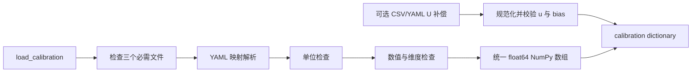

# 标定配置加载器说明

## 图例

| 标记 | 含义 |
| --- | --- |
| 必需 | 文件不存在即报错 |
| 可选 | 文件不存在时返回 `None` |
| `px` | 图像像素单位 |
| `mm` | 三维坐标及平移单位 |

## 输入与输出

| 文件 | 参数 | NumPy 输出 |
| --- | --- | --- |
| `camera_intrinsics.yaml` | `K`, `D` | `(3,3)`, `(N,)` |
| `laser_plane.yaml`（兼容文件名） | `laser_model` | 模型映射；全局平面另含 `plane_abcd (4,)` |
| `camera_ground_extrinsics.yaml` | `R`, `t` | `(3,3)`, `(3,)` |
| `ground_bias_table.csv` / `ground_u_compensation.yaml` | `column_u_px`, `bias_mm` | 两个 `(N,)` 数组 |

返回字典固定包含：`K`、`D`、`laser_model`、`R`、`t`、
`ground_u_compensation`。旧全局平面输入额外提供 `plane_abcd`。

## 单位约定

- 内参显式单位只接受 `px/pixel/pixels`；缺失时默认像素。
- 激光表面模型和外参平移只接受 `mm/millimeter/millimeters`；缺失时默认毫米。
- 旋转矩阵单位若声明，只接受 `dimensionless/unitless/1`。
- CSV 补偿表用列名声明单位：`column_u_px` 为像素，`bias_mm` 为毫米。
- YAML 兼容 `sample_table: [[u_px, bias_mm], ...]`；显式单位允许 `px` 或 `mm`。

## 兼容格式

加载器同时接受仓库已有的 `camera_matrix/dist_coeffs`，以及：

```yaml
plane:
  a: 0.0
  b: 0.2
  c: 0.98
  d: -200.0
```

曲面模型示例：

```yaml
model_type: circular_cone
axis_unit_camera: [0.0, 0.0, 1.0]
apex_camera_mm: [0.0, 0.0, 200.0]
half_apex_angle_deg: 45.0
```

## 流程图


