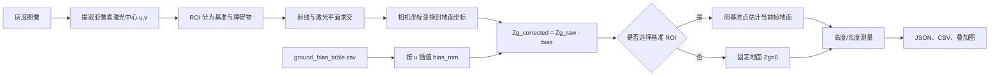

# 单帧线激光测量工具：地面 U 向补偿操作指南

本文说明如何使用 `ground_bias_validation_results_v2_0728` 的结果，在单帧测量工具中真正启用地面弯曲补偿，以及如何从命令行启动、切换标定和排查问题。

## 1. 补偿现在如何生效

原始重建链路得到地面坐标 `(Xg, Yg, Zg_raw)` 后，程序用原始图像列坐标 `u` 查询补偿表：

```text
bias = linear_interpolate(column_u_px, bias_mm, u)
Zg_corrected = Zg_raw - bias
```

- CSV 中存在该列：使用对应 `bias_mm`。
- CSV 中间缺列：在左右相邻有效列之间线性插值。
- `u` 超出补偿表范围：使用最近端点的偏差值，不做外推。
- 配置为 `null`：完全跳过补偿，保持原重建结果。
- 只修正 `Zg`；`u/v`、相机坐标 `Xc/Yc/Zc` 和地面坐标 `Xg/Yg` 不变。

补偿在统一重建函数内执行，因此以下入口行为一致：

- GUI 的“二维恢复并测量”；
- 保存的 `baseline_points.csv` 与各障碍物独立点云 CSV；
- 保存的整幅激光线地面点云 `full_laser_ground.ply`；
- Python 接口 `reconstruct_uv_to_ground()`。



图例：主链路为图像到结果；补偿表从旁路进入 `Zg` 修正步骤。

## 2. 0728 标定文件对应关系

默认配置已切换到以下四项结果：

| 配置项 | 文件 |
| --- | --- |
| `calibration.intrinsics` | `outputs/calib_03_0728/calibration_result.yaml` |
| `calibration.laser_plane` | `outputs/calib_03_0728_laser_plane/laser_plane.yaml` |
| `calibration.extrinsics` | `outputs/ground_extrinsics_v2_0728/camera_ground_extrinsics.yaml` |
| `calibration.ground_u_compensation` | `outputs/ground_bias_validation_results_v2_0728/ground_bias_table.csv` |

这四项必须来自同一相机、镜头、分辨率、安装姿态和标定批次。补偿表不能与旧内参、旧激光平面或旧地面外参混用。

0728 CSV 已验证包含 2345 行有效采样，覆盖 `u=0…2447 px`，程序只要求并读取两列：

| CSV 列 | 含义 | 是否必需 |
| --- | --- | --- |
| `column_u_px` | 原始图像横坐标，像素 | 是 |
| `bias_mm` | 需要从原始 `Zg` 减去的系统偏差，毫米 | 是 |
| `xg_mm`、`raw_mean_z_mm` 等 | 标定诊断信息 | 否，工具会忽略 |

## 3. 首次安装与启动

以下命令均在 PowerShell 中执行。

### 3.1 安装依赖

```powershell
cd G:\dev\projects\0704linescan\laser_measurement_tool
python -m pip install -r requirements.txt
```

建议确认当前 Python：

```powershell
python --version
python -m pip --version
```

### 3.2 使用默认 0728 配置启动

```powershell
cd G:\dev\projects\0704linescan\laser_measurement_tool
python main.py
```

等价的显式写法：

```powershell
python main.py --config configs\measure_tool.yaml
```

### 3.3 使用另一份配置启动

```powershell
python main.py --config "D:\measurement_configs\measure_tool_machine_b.yaml"
```

命令行参数只有一个：

| 参数 | 类型 | 默认值 | 说明 |
| --- | --- | --- | --- |
| `--config` | YAML 文件路径 | `configs/measure_tool.yaml` | 指定整套标定、提取、重建、测量和输出参数；路径可为相对或绝对路径 |

当前 GUI 不提供 `--image` 或 ROI 命令行参数；图像加载和 ROI 框选在界面中完成。

## 4. GUI 操作流程

1. 点击“加载图像”，选择待测灰度图。
2. 选择 `centroid`，点击“提取激光线”。
3. 添加一个或多个“障碍物区域”，红框按添加顺序编号并独立测量。
4. 可选：添加一个或多个“基准区域”；所有蓝框合并为公共基准，完全不添加时使用 `Zg=0`。
5. 点击“三维恢复并测量”。每个障碍物分别拟合，所有重建点使用同一 U 向补偿。
6. 检查右侧“地面噪声 σ”和拟合结果。
7. 点击“保存结果”。

`result.json` 的 `calibration.ground_u_compensation` 会记录实际使用的 CSV 路径，
`ground_reference_mode` 记录 `baseline_roi` 或 `zg_zero`；点云 CSV
中的 `Zg` 已经是补偿后的值。

多障碍物结果写入 `result.json` 的 `obstacles` 数组；顶层 `results_mm` 和旧版
`height_total/height_inliers` 仍对应障碍物 1，用于兼容旧版读取程序。

每次点击“保存结果”还会生成 `full_laser_ground.ply`。它包含当前图像中提取到的
全部有效激光中心，而不是只包含基准/障碍物 ROI。PLY 顶点为补偿后的
`Xg Yg Zg`，单位 mm，坐标系为 ground；同时保存由当前点云 `Zg` 最小值到
最大值经高对比度亮色图映射的 RGB 顶点颜色，CloudCompare 可直接识别。被工作
距离或几何有效性规则过滤的点不会写入。对应有效点数记录在 `result.json` 的
`point_counts.full_laser_reconstructed`。

### 4.1 两种测量模式

| 操作 | 参考方式 | 结果差异 |
| --- | --- | --- |
| 基准 ROI + 障碍物 ROI | 基准点 `Zg` 的稳健中位数 | 提供地面噪声和与基准线夹角，推荐用于精密测量 |
| 只有障碍物 ROI | 固定 `Zg=0 mm` | 地面噪声、基准线夹角和基准叠加线显示为 `—` |

如果画过基准 ROI 但其中没有中心点，程序会要求调整或删除该 ROI；只有完全
没有基准 ROI 时才自动进入 `zg_zero` 模式。

## 5. 配置参数解释

配置文件为 `laser_measurement_tool/configs/measure_tool.yaml`。所有相对路径均相对于该 YAML 所在目录解析，而不是相对于当前 PowerShell 目录。

### 5.1 标定与补偿

```yaml
calibration:
  intrinsics: calibration/camera_intrinsics.yaml
  laser_plane: calibration/laser_plane.yaml
  extrinsics: calibration/camera_ground_extrinsics.yaml
  ground_u_compensation: calibration/ground_u_compensation.csv
```

- `intrinsics`：相机内参矩阵和畸变参数。
- `laser_plane`：相机坐标系中的激光平面，单位 mm。
- `extrinsics`：`ground <- camera` 的地面外参。
- `ground_u_compensation`：CSV 或 YAML 补偿表；设为 `null` 关闭。

兼容的 YAML 补偿格式为：

```yaml
units: px
sample_table:
  - [0.0, 1.551]
  - [1.0, 1.546]
  - [2.0, 1.536]
```

其中每行是 `[column_u_px, bias_mm]`。`column_u_px` 必须严格递增且不能重复。

### 5.2 激光中心提取

| 参数 | 单位 | 说明 |
| --- | --- | --- |
| `extraction.method` | — | 当前默认为统一实时 `steger`；`shared_steger` 是兼容别名 |
| `background_kernel` | px | 背景抑制高斯核，必须为奇数 |
| `min_local_contrast_dn` | DN | 最低局部对比度；调低会增加弱线点，也可能增加噪声 |
| `centroid_window_radius` | px | 灰度重心窗口半径 |
| `segment_min_columns` | 列 | 最短有效连续段，较大时过滤短杂散线 |
| `continuity_max_column_gap` | 列 | 连续段允许的最大横向缺口 |
| `continuity_max_vertical_jump` | px | 相邻有效列允许的最大纵向跳变 |
| `correction_window` | 点 | 段内平滑窗口，`1` 表示关闭 |
| `correction_max_shift` | px | 平滑允许改变中心位置的上限 |
| `scan_axis` | — | 水平条纹用 `column`，竖直条纹用 `row` |

Steger 专用参数：

| 参数 | 单位 | 说明 |
| --- | --- | --- |
| `sigma` | px | 高斯导数尺度，中央 profile 默认 1.5；FWHM 2～3 px 可在 1.2～2.0 间验证 |
| `threshold` | DN | 原始灰度下限；与 centroid 的局部对比度阈值不同 |
| `deriv_thresh` | — | 亮脊线法向二阶导数绝对值下限 |
| `roi_margin` | px | 自动检测条纹带后的扩展量，需覆盖地面与障碍物高度差 |
| `roi_max_height` | px | Hessian 计算带最大宽度，限制内存和耗时 |
| `scan_axis` | — | 水平条纹 `column`，竖直条纹 `row` |

标定与在线测量使用同一套 `laser/realtime_steger.py` 实现；具体点数和速度
会随 CPU、SciPy 版本、曝光和条纹带高度变化，首次使用还包含 SciPy 导入开销。

### 5.3 重建、测量与输出

| 参数 | 说明 |
| --- | --- |
| `parallel_epsilon` | 射线近似平行于激光平面时的判定阈值 |
| `min_camera_depth_mm` / `max_camera_depth_mm` | 相机坐标 `Zc` 的有效工作距离 |
| `outlier_sigma_multiplier` | 拟合离群点的稳健 σ 倍数阈值 |
| `outlier_max_iterations` | 离群点剔除最大迭代次数 |
| `min_baseline_points` / `min_height_points` | 两类 ROI 的最少重建点数 |
| `output.dir` | 结果目录，相对配置 YAML 解析 |
| `save_pointcloud_csv` | 是否保存基准/障碍物重建点 CSV |
| `save_overlay_png` | 是否保存叠加结果图 |
| `save_full_pointcloud_ply` | 是否保存整幅激光线补偿后的地面系 PLY |

测量目录的典型结构：

```text
图名_measure/
├─ laser_center.csv             # 整幅图二维亚像素中心 u,v
├─ result.json
├─ baseline_points.csv          # 仅现场基准模式存在
├─ height_points.csv            # 只有一个障碍物时
├─ obstacle_1_points.csv        # 多个障碍物时，替代 height_points.csv
├─ obstacle_2_points.csv
├─ full_laser_ground.ply        # 整幅图全部有效激光中心，Xg/Yg/Zg，mm
└─ overlay.png
```

## 6. 开关补偿与 A/B 对比

启用：

```yaml
ground_u_compensation: ../../outputs/ground_bias_validation_results_v2_0728/ground_bias_table.csv
```

关闭：

```yaml
ground_u_compensation: null
```

建议复制两份配置分别启动并对同一图像、同一 ROI 测量。重点比较：

- `result.json -> results_mm -> ground_noise_sigma`；
- `baseline_points.csv` 中 `Zg` 的峰峰值、标准差和随 `u` 的趋势；
- 目标高度均值是否更接近已知量块高度。

补偿表验证报告中的极小残差来自建表/验证数据，不等于任意测量帧都必然达到同一数值；曝光、散斑、提取误差和安装变化仍会贡献噪声。

## 7. Python 接口调用

在 `laser_measurement_tool` 目录运行自己的脚本时：

```python
import numpy as np

from calibration.config_loader import load_calibration_files
from reconstruction.reconstructor import reconstruct_uv_to_ground

calibration = load_calibration_files(
    intrinsics=r"..\outputs\calib_03_0728\calibration_result.yaml",
    laser_plane=r"..\outputs\calib_03_0728_laser_plane\laser_plane.yaml",
    extrinsics=r"..\outputs\ground_extrinsics_v2_0728\camera_ground_extrinsics.yaml",
    ground_u_compensation=(
        r"..\outputs\ground_bias_validation_results_v2_0728\ground_bias_table.csv"
    ),
)

pixels_uv = np.array([[100.0, 720.25], [101.0, 720.30]], dtype=np.float64)
result = reconstruct_uv_to_ground(pixels_uv, calibration)

print(result.pixels_uv)      # 有效的原始 u,v
print(result.points_camera)  # 未做地面偏差修正的相机系交点
print(result.points_ground)  # Zg 已应用 U 向补偿
```

若调用者已经持有地面点和逐行对齐的像素点，也可直接使用：

```python
from reconstruction.reconstructor import apply_ground_u_compensation

corrected = apply_ground_u_compensation(
    points_ground,
    pixels_uv,
    calibration["ground_u_compensation"],
)
```

测量接口的两种用法：

```python
from measurement.height_measure import MeasurementParams, measure_height_line

# 现场基准模式
with_baseline = measure_height_line(
    baseline_ground, height_ground, MeasurementParams()
)

# 固定零基准模式
zg_zero = measure_height_line(None, height_ground, MeasurementParams())
assert zg_zero.ground_reference_mode == "zg_zero"
```

## 8. 测试和配置自检

运行全部单元测试：

```powershell
cd G:\dev\projects\0704linescan
$env:PYTHONPATH=".;laser_measurement_tool"
python -m unittest discover -s laser_measurement_tool\tests -p "test_*.py" -v
```

仅验证补偿相关测试：

```powershell
python -m unittest laser_measurement_tool.tests.test_config_loader laser_measurement_tool.tests.test_reconstructor -v
```

## 9. 常见错误

| 报错 | 原因与处理 |
| --- | --- |
| `必须包含列 column_u_px 和 bias_mm` | 指向了错误 CSV；应选 `ground_bias_table.csv` |
| `column_u_px 必须严格递增且不能重复` | 表格顺序错误或有重复列；重新生成/整理补偿表 |
| `标定文件不存在` | 相对路径是相对于配置 YAML，而非当前目录 |
| 启动时报缺少 `PySide6` | 执行 `python -m pip install -r requirements.txt` |
| 补偿后仍有明显倾斜 | 核对四项文件是否属于同一 0728 标定链路及相机安装是否移动 |
| 想临时禁用补偿 | 将 `ground_u_compensation` 设为 `null` 后重启工具 |

## 10. 复制到另一台电脑

默认配置使用 `configs/calibration/` 中的内部文件，因此可以单独复制或克隆
`laser_measurement_tool` 文件夹。运行时只需保持以下内部结构：

```text
laser_measurement_tool/
├─ configs/
│  ├─ measure_tool.yaml
│  └─ calibration/
│     ├─ camera_intrinsics.yaml
│     ├─ laser_plane.yaml
│     ├─ camera_ground_extrinsics.yaml
│     └─ ground_u_compensation.csv
└─ main.py
```

这些标定只适用于当前设备和安装位置。更换设备后，应替换上述四个文件，或在
新的配置 YAML 中引用另一套同样位于工具目录内的标定文件。
