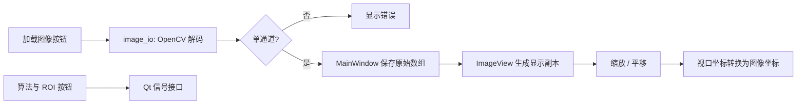

# 图像显示界面改动说明

## 图例

| 标记 | 含义 |
| --- | --- |
| GUI | PySide6 界面层 |
| IO | OpenCV 灰度图像读取层 |
| API | 为后续算法或 ROI 交互保留的信号接口 |

## 主要改动

- 左侧使用 `ImageView` 显示灰度图像，支持鼠标滚轮缩放和左键拖动平移。
- 场景坐标与图像坐标保持一比一，通过显式转换方法处理视口、场景和图像坐标。
- 右侧提供加载、激光提取、两类 ROI、三维恢复和保存按钮。
- 原始位深图像保存在主窗口，显示副本归一化为 8 位，不改变后续算法输入。
- 算法按钮通过 Qt 信号暴露接口，本次不实现具体算法或 ROI 框选。

## 代码流程图

