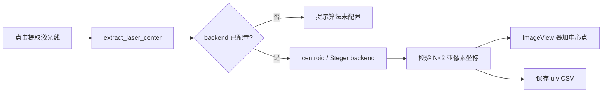

# 激光中心提取接口改动说明

## 图例

| 标记 | 含义 |
| --- | --- |
| GUI | PySide6 展示与用户操作 |
| API | 稳定的提取与算法适配接口 |
| Backend | 已接入的 centroid / Steger 或后续 Gaussian、RANSAC 实现 |
| IO | 中心点 CSV 输出 |

## 主要改动

- 新增 `extract_laser_center(image, params)`，统一返回 `float64` 的 `N×2` 亚像素 `(u, v)` 数组。
- `params.backend` 接收算法适配函数；当前正式链内置统一实时 Steger，centroid 仅保留作对照。
- 接口统一检查灰度输入、输出形状和有限数值，backend 异常转换为明确的提取错误。
- GUI 在提取成功后叠加绿色中心点，并将 CSV 自动写入 `output/`；重名时追加序号。
- Steger 统一调用 `calibration/src/realtime_steger.py` 的 Hessian + 二阶泰勒定位，并修复轴对齐条纹退化问题。

## 代码流程图



## Steger 接口示例

```python
from laser.backends import create_extraction_params

params = create_extraction_params("steger", {
    "sigma": 1.5,
    "threshold": 30.0,
    "deriv_thresh": 0.5,
    "roi_margin": 120,
    "roi_max_height": 512,
    "scan_axis": "column",
})
centers_uv = extract_laser_center(image, params)
```
