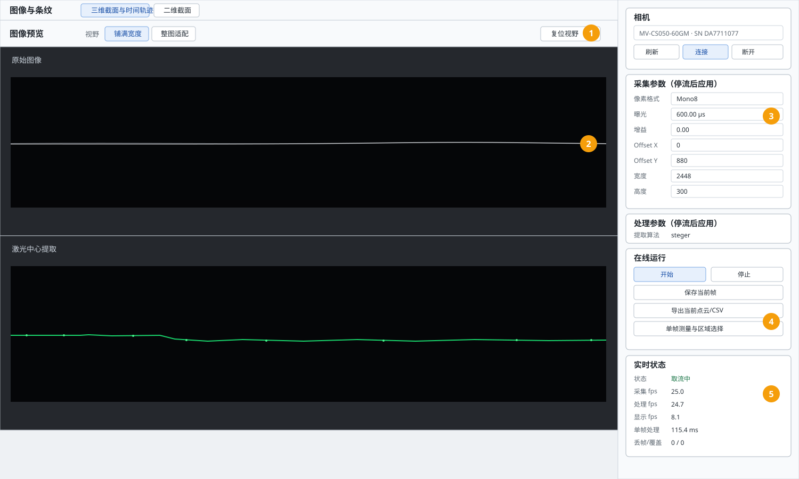
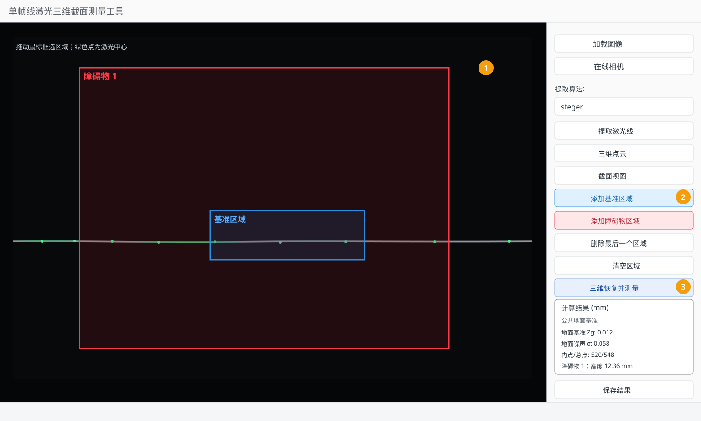

# 在线线激光三维截面测量工具用户手册

> 适用目录：`0704line-laser-3d-scanner/laser_measurement_tool`  
> 适用入口：`online_camera.py`（大恒使用 `--camera-backend daheng`）；也可以从离线主窗口点击“在线相机”打开（该入口默认海康 MVS）
> 当前默认：`Mono8`、曝光 `600 μs`、增益 `0 dB`、硬件 ROI `2448 × 300`、`Offset X=0`、`Offset Y=880`  
> 坐标和结果单位：毫米（mm）；像素坐标遵循 OpenCV 的 `(u, v)` 约定

本手册针对当前第一阶段可运行版本，覆盖相机连接、实时取流、激光中心提取、三维恢复、单帧区域测量、结果导出和标定配置替换。界面中的按钮名称以当前代码为准；如果后续增加按钮，应同步更新本文件。

## 1. 功能边界与使用前提

实时工具处理的是“单条激光线在当前帧中的三维截面”。它可以连续取流并显示最近 1 秒的点历史，但时间轨迹不是编码器同步的连续扫描表面，也不是完整的机器人/平台扫描系统。

当前链路包括：

1. 海康 MVS、大恒 Galaxy USB3 相机或 synthetic 模拟相机取流；
2. `centroid`、`steger`、`shared_steger` 三种激光中心提取后端；
3. 相机内参去畸变、激光圆锥面求交、地面坐标转换；
4. 三维点云、沿激光线距离 `S-Zg` 二维截面和地面/障碍物区域测量；
5. 当前帧图像、中心点 CSV、点云 CSV/PLY、叠加图和 JSON 元数据导出。

正式测量前必须固定相机、镜头、激光器、支架、焦距、光圈、像素格式、分辨率和 ROI。以下任一项改变，都应重新标定或至少重新完成独立验证：

- 相机或激光器的位置、姿态、工作距离改变；
- 镜头焦距、对焦或光圈改变；
- `PixelFormat`、`OffsetX/OffsetY`、宽度或高度改变；
- 标定文件、激光模型、地面外参或提取算法改变。

## 2. 安装与启动

### 2.1 安装依赖

进入包含 `online_camera.py` 的项目目录并建立虚拟环境。PowerShell 示例：

```powershell
cd <项目目录>
python -m venv .venv
.\.venv\Scripts\python.exe -m pip install -r .\requirements.txt
```

依赖包括 PySide6、OpenCV、NumPy、SciPy、PyYAML、Matplotlib、pyqtgraph 和 PyOpenGL。真实相机还需要正确安装对应 backend 的 SDK：海康使用 MVS，大恒使用 Galaxy SDK 随附的 `gxipy`。

### 2.2 启动真实相机

```powershell
cd <项目目录>
.\.venv\Scripts\python.exe .\online_camera.py
```

默认读取：

```text
configs/measure_tool.yaml
```

显式指定配置或覆盖提取算法：

```powershell
.\.venv\Scripts\python.exe .\online_camera.py `
  --config .\configs\measure_tool.yaml `
  --method steger
```

### 2.3 使用模拟相机检查界面

没有相机或暂时不想加载真实相机 SDK 时：

```powershell
.\.venv\Scripts\python.exe .\online_camera.py --simulate
```

模拟模式用于检查界面、线程、录制和输出路径，不用于验证真实相机的曝光、成像质量或最终测量精度。

### 2.4 启动大恒 Galaxy USB3 相机

大恒 backend 使用 Galaxy SDK 自带的 Python `gxipy` wrapper，不需要编译 C++ SDK。默认 SDK 目录为：

```text
C:\Program Files\Daheng Imaging\GalaxySDK
```

如果 SDK 安装在其他位置，可设置 `DAHENG_GALAXY_ROOT`；如果 Python wrapper 不在默认示例目录，可设置 `DAHENG_GALAXY_PYTHON_PATH`。程序会自动配置 `GALAXY_GENICAM_ROOT`、`GENICAM_GENTL64_PATH` 和 Windows DLL 搜索路径。

先用厂商示例或以下命令验证 Python 解释器：

```powershell
$galaxy = "C:\Program Files\Daheng Imaging\GalaxySDK"
$env:DAHENG_GALAXY_ROOT = $galaxy
$env:DAHENG_GALAXY_PYTHON_PATH = "$galaxy\Development\Samples\Python"
$env:PYTHONPATH = "$galaxy\Development\Samples\Python;$env:PYTHONPATH"
python -c "import gxipy; print(gxipy.__file__); print(gxipy.__version__)"
```

启动大恒 backend：

```powershell
.\.venv\Scripts\python.exe .\online_camera.py `
  --camera-backend daheng `
  --config .\configs\measure_tool.yaml
```

程序只显示 Galaxy SDK 枚举结果中的 USB3 (`U3V`) 设备，并按序列号打开。应先关闭 GalaxyView 或其他占用相机的程序。

当前仓库内置的在线标定 manifest 是海康 `2448×2048` 配置；大恒 ME2P-1230 常用全幅为 `4096×3000`。接入大恒后必须使用与大恒相机、镜头和安装姿态匹配的独立标定 manifest，不能直接把海康标定用于正式测量。现有静态采集配置中的 `4096×512、OffsetY=1244` 只能作为设备验证起点，仍需以相机节点实际范围和标定结果为准。

### 2.5 启动前检查

- 关闭 MVS 客户端、GalaxyView、相机厂商调试软件和其他可能占用设备的程序；
- 确认相机与电脑网络或 USB 连接正常；
- 确认 `configs/measure_tool.yaml` 引用的标定文件存在；
- 确认 `calibration.manifest` 与引用文件的哈希一致；
- 确认激光线不会长时间照射相机造成大面积饱和；
- 正式运行建议先用一张已知图像完成离线验证，再连接真实相机。

## 3. 界面总览



上图是按当前 `OnlineCameraWindow` 布局制作的界面截图，右侧数字对应下面的操作区：

| 标号 | 区域 | 作用 |
|---:|---|---|
| 1 | 图像视野工具栏 | 切换“铺满宽度/整图适配”，或点击“复位视野”恢复初始显示范围 |
| 2 | 原始图像与激光中心提取 | 上框显示相机原始灰度图，下框显示提取叠加图 |
| 3 | 相机与采集参数 | 刷新、连接、断开设备，设置曝光、增益、像素格式和硬件 ROI |
| 4 | 在线运行 | 开始/停止取流、保存当前帧、导出当前点云/CSV、进入单帧测量、定长录制 |
| 5 | 实时状态 | 查看状态、采集/处理/显示 fps、单帧处理耗时、丢帧/队列覆盖和录制状态 |

### 3.1 三个主视图

#### 图像与条纹

- “原始图像”：显示相机收到的灰度帧；Mono8 使用 0～255 显示，Mono12 使用 0～4095 显示；
- “激光中心提取”：显示当前帧和提取出的激光中心叠加结果；
- “铺满宽度”：按当前窗口宽度优先显示；
- “整图适配”：保证整幅图像在视图中可见；
- “复位视野”：恢复两个图像视图的初始范围；双击图像也可以复位。

视图缩放只改变显示，不改变原始像素、中心点坐标或三维计算。

#### 三维截面与时间轨迹

切换到第二个标签后，可以使用：

- “透视/俯视/前视/侧视”：切换固定观察角度；
- “地面网格”：显示地面参考网格；
- “原点标记”：显示地面坐标原点；
- “方向罗盘”：显示 `Xg/Yg/Zg` 方向；
- “时间轨迹”：显示最近 1 秒的历史点；
- “适配点云”：把当前点云缩放到可见范围。

底部会显示当前截面点数、`Xg/Yg/Zg` 范围、`Zg` 高度色带和地面补偿状态。若显示“Zg 补偿 已应用”，表示当前标定包加载了地面 U 向补偿；鼠标悬停可以查看补偿范围。

#### 二维截面

第三个标签显示沿地面激光线主方向的 `S-Zg` 截面曲线，因此横向、纵向或斜向激光线均可使用。工具栏参数为：

- `ΔS`：相邻点允许连接的最大沿线间隔；
- `ΔZg`：相邻点允许连接的最大高度跳变；
- `3D`：相邻点允许连接的最大三维距离；
- “网格”：显示/隐藏网格；
- “零基准”：显示/隐藏 `Zg=0` 参考线；
- “十字游标”：移动鼠标时显示最近点的 `S/Zg`；
- “自动高度”：按主体点的稳健高度范围调整纵轴，少量孤立点不会压扁主体；手动缩放后会关闭；
- “适配截面”：显示包括孤立点在内的完整截面，并关闭“自动高度”。

断线阈值只影响二维曲线的连线显示，不会改变原始点云或测量结果。

## 4. 相机连接与实时取流

### 4.1 连接顺序

按以下顺序操作：

1. 点击“刷新”，等待设备列表更新；
2. 在下拉框选择目标相机，确认型号和序列号；
3. 点击“连接”；
4. 检查“采集参数（停流后应用）”中的像素格式、曝光、增益和 ROI；
5. 点击“开始”；
6. 观察“状态”是否变成“取流中”，并确认上下两个图像框都在更新；
7. 结束时先点击“停止”，再点击“断开”。

状态含义：

| 状态 | 含义 |
|---|---|
| `未连接` | 尚未建立相机会话 |
| `连接中` | 正在打开 SDK 设备 |
| `已连接` | 相机已打开但没有取流 |
| `启动中` | 正在应用参数并启动处理线程 |
| `取流中` | 相机、提取和显示链路正在运行 |
| `停止中` | 正在等待采集线程安全退出 |
| `错误` | 需要查看弹窗或状态栏中的具体错误 |

录制提交失败或逐帧处理失败时，工具会优先保留相机采集：原始图像和原始帧录制仍可继续，状态会显示“录制失败，取流仍在运行”或“处理异常，取流仍在运行”。只有相机取帧失败、人工停止或人工断开才会停止实时流；相机取帧异常会同时显示错误弹窗和状态栏提示。

### 4.2 采集参数

| 字段 | 当前默认 | 说明 |
|---|---:|---|
| 像素格式 | `Mono8` | 正式测量建议与标定保持一致；Mono12 仅在整套标定和验证也使用 Mono12 时采用 |
| 曝光 | `600.00 μs` | 传感器积分时间；不是显示亮度开关 |
| 增益 | `0.00 dB` | 建议先保持 0，通过曝光、光学和遮光改善信噪比 |
| Offset X | `0` | ROI 左上角在传感器全幅中的横向偏移 |
| Offset Y | `880` | 当前硬件 ROI 默认纵向偏移 |
| 宽度 | `2448` | 当前 ROI 宽度 |
| 高度 | `300` | 当前 ROI 高度 |

这些控件标记为“停流后应用”：取流时不可编辑或修改不会立即用于处理。需要改变像素格式、Offset、宽度或高度时，必须先“停止”，修改后重新“开始”。相机回读值可能与请求值存在设备限制差异，重新连接或开始取流后应以界面实际值为准。

曝光调整建议：

1. 先保持 `Mono8`、增益 `0 dB`、曝光 `600 μs`；
2. 观察激光线是否连续、是否有明显饱和带；
3. 线太暗或断线多时逐步增加曝光；
4. 大面积饱和、中心线变粗或提取点抖动时降低曝光；
5. 记录最终曝光，并在标定/验证数据中保持同一成像条件。

不要仅凭屏幕上的视觉亮度判断曝光。Mono8 和 Mono12 的显示量程不同，显示缩放也不改变原始 DN。

### 4.3 提取算法

“处理参数（停流后应用）”中的可选项：

- `centroid`：局部强度加权中心，适合快速对照；
- `steger`：当前正式实时链路，使用 Hessian/二阶展开计算亚像素中心；
- `shared_steger`：历史兼容名称，当前与实时 Steger 共享同一套中心提取实现。

正式标定和运行建议使用同一个算法。下拉框切换只影响下一次启动的当前会话；要改变配置默认值，应修改 `measure_tool.yaml` 的 `extraction.method`。

### 4.4 Session 基准标定

在线窗口的“Session 基准标定”会原地进入 Daheng Session calibration mode：保存当前
完整 `CameraConfig`，切到 `OffsetX/Y=0、Width=4096、Height=3000` 的全幅预览，并在
界面下方显示角点 overlay。曝光/增益可在模式内编辑，程序自动执行停流配置后恢复取流；
退出或取消时恢复原 ROI、曝光、增益和像素格式，不写入持久相机配置。

进入模式只启动全幅预览，不会自动消耗 PnP 尝试次数。调好曝光/增益、确认上下预览已经
显示完整棋盘后，点击“采集 PnP 棋盘格（5 帧）”，工具才会连续收集最多配置允许尝试次数
中的 `5` 个有效帧；每帧必须检测到完整 `88/88` 角点，然后对同序角点取 median，再调用
Session-1 的同一 `solvePnP` API。棋盘检测在后台执行，GUI 仅更新最新预览和 overlay，界面
还显示最终 RMSE、帧间 translation/rotation repeatability，以及棋盘饱和、动态范围和靠边
warning。

完成 5 帧正式 median-PnP 后，工具会在同一次标定中自动执行 5 个
leave-one-frame-out/jackknife QA fold：每个 fold 只用其余 4 帧的 median 角点求
QA 外参，不替换正式 `R/t`，也不增加采集。QA 会报告 held-out reprojection、相对
正式解的 `ΔR/Δt`、ground-plane normal/distance 差异，并把差异传播到棋盘物理边界
的固定 `Xg/Yg` grid，给出 full-FOV、center、edge 的预测 `ΔZg` Bias/RMSE/P95/Max。
该结果只表示本次 Session 的删除帧稳定性，不是绝对外参准确度；也不使用
Session Ground correction 掩盖 PnP 误差。

成功后只替换当前进程的 runtime ground `R/t`，reference YAML、manifest、C0/C1
和激光模型均不修改。实时状态会显示：

- `ground 外参`：`reference` 或 `session`；
- `Session 状态`：`VALID/INVALID`；
- 检测角点数、重投影 RMSE、相对 reference 的 `Δtranslation` 和 `Δrotation`；
- `PnP 帧数`、frame repeatability、Session PnP QA 摘要和质量 warning。

最新尝试会保存为输出目录下的 `session_ground_calibration.json`。例如：

```json
{
  "status": "VALID",
  "runtime": {"ground_extrinsic_source": "session"},
  "detection": {"corner_count": 88, "reprojection_rmse_px": 0.12},
  "delta": {"translation_mm": 0.31, "rotation_deg": 0.04},
  "frame_repeatability": {"translation_max_mm": 0.08},
  "session_pnp_qa": {
    "method": "leave_one_frame_out",
    "fold_count": 5,
    "status": "PASS",
    "stability": "HIGH",
    "zg_propagation": {"rmse_mm": 0.03, "p95_abs_mm": 0.05, "edge_p95_abs_mm": 0.08}
  }
}
```

`optional`（开发默认）允许直接使用 reference；`required` 需要先连接相机并完成
Session 标定，之后才允许开始在线重建；`disabled` 隐藏该入口并始终使用 reference。

## 5. FPS、处理耗时与丢帧解释

实时状态中的几个数值不是同一个概念：

| 指标 | 含义 | 用途 |
|---|---|---|
| 采集 fps | 相机帧进入采集循环的频率 | 判断相机/传输是否稳定 |
| 处理 fps | 帧完成提取和重建的频率 | 判断算法吞吐能力 |
| 显示 fps | GUI 实际刷新预览的频率 | 判断界面绘制压力；不是处理吞吐 |
| 单帧处理 | 最近一次处理耗时 | 分析算法、内存或 CPU 峰值 |
| 丢帧/覆盖 | 相机帧号间隙 / 处理队列覆盖次数 | 判断实时链路是否跟不上输入 |

当前显示 fps 使用最近约 1 秒的滚动窗口，启动初期会从较低值逐渐稳定；它不再用“程序启动以来累计帧数 ÷ 总时间”计算。因此看到采集 fps 高于显示 fps 并不一定是算法变慢：GUI 只在有限频率刷新，处理线程可以继续工作。真正需要优先关注的是“处理 fps”和“丢帧/覆盖”。

建议按以下顺序排查实时性：

1. `采集 fps` 低：检查相机触发/传输、曝光、网卡或 SDK；
2. `处理 fps` 低且单帧处理高：检查提取参数、ROI 高度、CPU 占用和标定模型；
3. `显示 fps` 低但处理 fps 正常：先切换到“图像与条纹”或关闭三维时间轨迹，确认是否只是绘制压力；
4. `丢帧/覆盖` 增长：处理队列无法及时消费，应降低输入负载或优化处理链；
5. 运行一段时间后突然下降：查看是否触发录制磁盘写入、系统降频、内存压力或相机 SDK 错误。

## 6. 保存当前帧、导出点云与定长录制

### 6.1 保存当前帧

点击“保存当前帧”时，默认文件名使用无损的 `.tif`；保存对话框仍可手动选择 `.png`、`.tif` 或 `.tiff`。保存图像的同时会写入同名 JSON sidecar，例如：

```text
frame_000123.tif
frame_000123.json
```

sidecar 至少包含：

- 图像宽、高和数据类型；
- `image_offset.u/v`，即硬件 ROI 在全幅标定坐标中的偏移；
- 相机帧号、相机时间戳和主机时间戳。

这个 JSON 很重要：后续用离线“单帧测量与区域选择”加载硬件 ROI 图像时，工具会优先读取它，自动把局部坐标转换回标定全幅坐标。

### 6.2 导出当前点云/CSV

点击“导出当前点云/CSV”，结果写入：

```text
laser_measurement_tool/output/online_measurements/<frame>_measure/
```

通常包含：

| 文件 | 内容 |
|---|---|
| `laser_center.csv` | 激光亚像素中心，使用标定全幅像素坐标 |
| `full_points.csv` | 像素、相机坐标和地面坐标的逐点对应 |
| `full_laser_ground.ply` | 地面坐标系全幅激光线点云，单位 mm |
| `overlay.png` | 激光中心叠加图 |
| `result.json` | 帧信息、提取器、标定包 ID/哈希、点数和过滤统计 |

`result.json` 是结果追溯入口。更换标定或算法后，不要把不同包产生的 CSV/PLY 混在同一个实验目录中。

### 6.3 定长录制

1. 在“定长录制”左侧输入帧数；
2. 确认当前状态为“取流中”；
3. 点击“定长录制”；
4. 等待状态显示完成，或点击“停止”取消。

默认写入：

```text
laser_measurement_tool/output/online_recordings/recording_YYYYMMDD_HHMMSS/
```

完整录制目录包含图像和 `frames.csv`。CSV 记录文件名、相机帧号、时间戳、曝光、增益、像素格式、ROI 偏移、分辨率和帧间隙。录制被取消时，未完成的临时目录会清理，不应把残留临时目录当作完整数据集。

录制完成后会把临时目录提交为正式目录。如果 Windows 文件占用等原因导致提交失败，`.recording_*` 临时目录会保留以便找回数据；此时录制任务会结束，但相机取流不会停止，状态会显示“录制失败，取流仍在运行”，可以直接点击“停止”或修复输出目录后再次录制，不需要断开重连。

## 7. 单帧测量与区域选择

实时窗口在已有一帧成功处理结果后，点击“单帧测量与区域选择”打开离线同款测量窗口。



### 7.1 标准操作步骤

1. 确认图像中有连续的绿色激光中心；
2. 点击“添加基准区域”，在平整地面段拖动框选一个或多个蓝色区域；
3. 点击“添加障碍物区域”，在障碍物激光线范围拖动框选红色区域；
4. 如有多个障碍物，逐个添加，程序按添加顺序编号为“障碍物 1、障碍物 2 …”；
5. 点击“删除最后一个区域”修正最近一次框选，或点击“清空区域”重新选择；
6. 点击“三维恢复并测量”，等待右侧显示结果；
7. 可切换“三维点云”或“截面视图”查看空间结果；
8. 点击“保存结果”保存完整测量文件。

### 7.2 基准区域与障碍物区域规则

- 多个基准区域会合并，用于拟合公共地面基准；
- 多个障碍物区域不会合并，每个区域独立拟合高度线；
- 添加基准区域后，如果区域内没有有效激光点，工具会报错并要求重新框选，不会静默退回固定零基准；
- 添加基准区域时，单帧测量优先使用所选区域拟合局部地面并计算障碍物相对高度；该拟合只作用于当前单帧，不会修改在线 Session 或全局标定；
- 完全不添加基准区域时，离线窗口使用固定 `Zg=0`；在线窗口若已有 Session 激光地面基准，则使用该 Session 地面参考，否则使用固定 `Zg=0`。没有局部基准拟合时，地面噪声和基准线夹角显示为 `—`；
- `min_baseline_points` 和 `min_height_points` 默认都是 `20`。点数指“经过提取、ROI 筛选、三维重建和有效性过滤后”的点，不是框内肉眼可见的绿色像素数量。

因此，看到激光线很长但提示“height line has too few points”时，先检查 ROI 是否框在绿色中心线上、是否选错了坐标偏移、是否被重建深度/模型范围过滤，再考虑降低点数门槛。

### 7.3 硬件 ROI 图像的坐标规则

当前默认配置只输出传感器中的 `2448 × 300` 硬件 ROI，左上角是全幅坐标 `(0, 880)`。大恒 ME2P-1230 等型号可以配置更大的传感器 ROI；图像界面中的框选坐标始终是 ROI 局部坐标，但三维恢复时会自动加回 `(OffsetX, OffsetY)`，再交给全幅标定模型。

从外部加载裁剪图时，按以下优先级恢复偏移：

1. 图像同名 `.json`；
2. 当前目录的 `result.json`；
3. 当前目录 `frames.csv` 中与文件名匹配的行；
4. 如果都没有，弹窗要求输入 `Offset X/Offset Y`。对当前默认 ROI，`OffsetY` 通常是 `880`，但这只是提示默认值，必须按实际采集设置确认。

全幅图像不需要偏移。裁剪图尺寸不能超过当前标定 manifest 的全幅尺寸，否则工具会拒绝按当前标定重建。海康 `2448 × 2048` 与大恒常见的 `4096 × 3000` 必须使用不同标定包。

### 7.4 结果面板字段

公共地面基准区显示：

- 地面基准 `Zg`；
- 地面噪声 `σ`；
- 基准线内点数/总点数，或 Session/固定 `Zg=0` 状态；
- 地面参考模式：基准 ROI 地面拟合、Session 激光地面基准或固定 `Zg=0`。

每个障碍物显示：

- 高度均值 ± 标准差；
- 高度中位数；
- 高度线长度；
- 与基准线夹角；
- 高度线拟合 RMSE；
- 高度线内点数/总点数。

## 8. 结果保存结构

离线单帧窗口点击“保存结果”后，输出根目录默认是：

```text
laser_measurement_tool/output/
└─ <图像名>_measure/
   ├─ laser_center.csv
   ├─ result.json
   ├─ baseline_points.csv
   ├─ height_points.csv              # 只有一个障碍物时
   ├─ obstacle_1_points.csv          # 多个障碍物时
   ├─ obstacle_2_points.csv
   ├─ overlay.png
   └─ full_laser_ground.ply
```

实际文件是否生成受 `output` 配置段中的保存开关影响。`laser_center.csv` 和 `result.json` 是最重要的追溯文件；PLY/CSV 是后续分析和可视化文件。

## 9. 标定与运行配置修改

### 9.1 唯一运行配置入口

在线工具的统一配置文件是：

```text
laser_measurement_tool/configs/measure_tool.yaml
```

相对路径都相对于该 YAML 文件所在目录解析。推荐不要直接覆盖默认文件，而是复制一份：

```powershell
Copy-Item .\laser_measurement_tool\configs\measure_tool.yaml `
  .\laser_measurement_tool\configs\measure_tool_machine_a.yaml
```

随后用 `--config` 运行这套配置。每套相机/标定组合保存一份 YAML，便于回滚和复现实验。

### 9.2 标定文件路径

当前配置结构：

```yaml
calibration:
  manifest: calibration/manifest.yaml
  intrinsics: calibration/calibration_result.yaml
  laser_model: calibration/circular_cone.yaml
  extrinsics: calibration/camera_ground_extrinsics.yaml
  ground_u_compensation: null
```

字段作用：

| 字段 | 内容 |
|---|---|
| `manifest` | 标定包清单、相机尺寸、提取器设置和各文件 SHA-256 |
| `intrinsics` | 相机内参矩阵和畸变系数 |
| `laser_model` | 当前正式激光表面模型；默认是 `circular_cone.yaml` |
| `extrinsics` | 相机坐标到地面坐标的外参 |
| `ground_u_compensation` | 可选的按图像列的地面高度补偿表 |

支持旧配置键 `laser_plane`，但新配置建议使用 `laser_model`。当前加载器接受全局平面、二次曲面和圆锥模型；模型单位必须是 mm。

如果 `manifest` 非空，它是运行时的权威标定来源，且会校验引用文件哈希。替换任何标定文件后，应由标定工具重新生成 manifest 或重新打包 calibration bundle，不要只手工修改 YAML 中的 SHA-256。

### 9.3 Session 基准标定配置

在线 GUI 可选地启用当前会话的棋盘格 ground 外参标定：

```yaml
session_ground_calibration:
  mode: optional              # disabled / optional / required
  pattern_cols: 11
  pattern_rows: 8
  square_size_mm: 20.0
  detector: sb_then_classic   # 或 classic
  output: null                # 默认写入 output.dir/session_ground_calibration.json
  quality:
    target_frames: 5
    max_capture_attempts: 8
    max_reprojection_rmse_px: 0.5
    saturation_ratio_warn: 0.05
    dynamic_range_p95_p5_warn: 20.0
    edge_margin_warn_px: 20.0
```

该 JSON 是独立的运行记录，重复标定只更新这个 JSON；不会覆盖
`calibration/camera_ground_extrinsics.yaml`。

### 9.4 激光提取配置

`measure_tool.yaml` 选择算法，实时 Steger 的共享 profile 随项目保存在配置目录中：

```text
configs/realtime_steger.yaml
```

当前 profile 的主要参数：

```yaml
steger:
  sigma: 1.5
  threshold: 30.0
  deriv_thresh: 0.5
  roi_margin: 48
  roi_max_height: 512
  scan_axis: column
```

说明：

- `sigma`：Steger 导数尺度；线宽变化时应通过固定数据集对照，不要凭肉眼随意修改；
- `threshold`：中心候选的响应阈值；过高会漏线，过低会引入噪声；
- `deriv_thresh`：导数响应门槛；
- `roi_margin`：活动条纹带上下文边界，当前从 `48 px` 开始；过宽会增加计算量，过窄可能截断 Hessian 上下文；
- `roi_max_height`：条纹带处理的最大高度；
- `scan_axis`：`column` 表示激光线接近水平、按列提取；竖直条纹才使用 `row`。

这个 profile 同时被标定和在线测量使用。修改后必须重新运行标定/验证，并在结果 JSON 中记录新的 profile 哈希或版本。

### 9.5 重建参数

```yaml
reconstruction:
  parallel_epsilon: 1.0e-9
  quadratic_epsilon: 1.0e-12
  min_camera_depth_mm: 600.0
  max_camera_depth_mm: 725.0
  model_range_margin_mm: 10.0
  image_roi_polygon: null
```

- `min_camera_depth_mm` / `max_camera_depth_mm` 是相机系有效深度范围；超出范围的点会被过滤；
- `model_range_margin_mm` 是激光模型有效范围的外扩；
- `image_roi_polygon` 是原始全幅像素坐标的固定四边形，不是硬件 ROI 局部坐标。仅在棋盘姿态固定时启用，姿态变化后要重新测量四个角点；
- 不要为了“显示更多点”盲目扩大深度范围，先确认标定模型和硬件工作距离。

### 9.6 测量参数

```yaml
measurement:
  outlier_sigma_multiplier: 2.0
  outlier_max_iterations: 5
  min_baseline_points: 20
  min_height_points: 20
```

修改原则：

- 先扩大/移动 ROI，确认点确实落在激光中心线上；
- 再检查硬件 ROI 偏移、深度范围和模型过滤统计；
- 最后才考虑降低最少点数或放宽离群点规则；
- 任何影响测量统计的改动都要用已知高度样件重新验证。

### 9.7 输出参数

```yaml
output:
  dir: ../output
  save_pointcloud_csv: true
  save_overlay_png: true
  save_full_pointcloud_ply: true
```

`dir` 仍按配置文件所在目录解析。建议为每个实验使用独立输出目录，避免不同标定包的结果混写。

### 9.8 曝光默认值与标定采集曝光的区别

在线窗口当前默认曝光 `600 μs` 由在线相机配置模型和界面初始值提供；`measure_tool.yaml` 目前不包含在线相机曝光字段，运行时请在右侧“采集参数”中确认实际回读值。

标定工具的相机模板（`calibration_tool/configs/camera*.yaml`）是另一套采集入口，其中的 `camera.exposure_us` 只作用于标定采集。正式标定和运行应尽量采用一致的像素格式、ROI 和光学条件；若调整了标定采集曝光，应重新确认实时工具的曝光和提取阈值。

## 10. 运行前后的验证命令

### 10.1 验证配置能否加载

在 `laser_measurement_tool` 目录执行：

```powershell
python -c "from app_config import load_app_config; c=load_app_config('configs/measure_tool.yaml'); print(c.config_path); print(c.extraction_method); print(c.calibration.manifest)"
```

如果路径、YAML 字段、标定文件或 manifest 哈希错误，命令会直接抛出具体字段信息。

### 10.2 运行测试

```powershell
cd <项目目录>
python -m pytest -q tests/test_online_core.py
python -m pytest -q tests/test_app_config.py tests/test_backends.py tests/test_reconstructor.py
```

GUI 相关测试需要 PySide6、pyqtgraph 和可用的 OpenGL/Qt 环境；在无桌面环境中可使用项目已有的 offscreen 测试方式。

### 10.3 最小现场验收

1. 用 `--simulate` 启动界面，确认三个视图和按钮可用；
2. 分别用默认 MVS 或 `--camera-backend daheng` 连接真实相机，确认型号、序列号、Mono8、曝光和 ROI；
3. 保存一帧，检查同名 `.json` 是否记录 `image_offset`；
4. 导出一帧，检查 `result.json` 中的标定包 ID、哈希和点数；
5. 使用平面样件和已知高度样件完成一次单帧区域测量；
6. 记录采集 fps、处理 fps、显示 fps、处理耗时和丢帧/覆盖计数。

## 11. 常见问题

### 11.1 “SDK 不可用”或找不到相机

先关闭 MVS 客户端或 GalaxyView，确认 SDK 位数与 Python 环境一致，再点击“刷新”。大恒还需确认 `DAHENG_GALAXY_ROOT` 或默认 Galaxy SDK 路径可用。如果模拟模式正常而真机模式失败，优先检查 SDK、网卡/USB、相机权限和序列号筛选。

### 11.2 原始图像正常但激光中心很少

依次检查：

1. 激光器是否开启、激光颜色和相机响应是否匹配；
2. `scan_axis` 是否与条纹方向一致；
3. 曝光是否过低或饱和；
4. `threshold`、`deriv_thresh`、`sigma` 是否适合当前线宽；
5. `roi_margin` 是否过窄；
6. 处理 ROI 是否过度裁剪。

### 11.3 采集 fps、处理 fps 和显示 fps 不一致

先看 `丢帧/覆盖`。如果为 0，说明当前没有检测到队列覆盖；显示 fps 低可能只是 GUI 刷新限制。如果处理 fps 也低，检查单帧处理耗时、CPU、三维模型和输入 ROI 高度。

### 11.4 测量提示点数小于 30

“30”是有效三维点门槛，不是图像中绿色点的肉眼数量。检查障碍物框是否覆盖绿色中心、框选坐标是否为 ROI 局部坐标、硬件 ROI 是否有正确 Offset、点是否被深度范围或模型范围过滤。裁剪图应优先使用同名 JSON 或 `frames.csv` 提供偏移。

### 11.5 硬 ROI 图像恢复结果明显错误

如果图像尺寸是 `2448 × 300`，加载时应确认 `OffsetY=880`（或输入实际值）；大恒 ROI 应填写真实回读的 Offset。不能把局部 `v` 直接当成全幅 `v`。在线“保存当前帧”会自动生成 sidecar JSON，推荐使用该 JSON 配套加载。

### 11.6 标定加载失败或 manifest 不匹配

检查 `measure_tool.yaml` 的五个标定路径、manifest 中的相对文件名和 SHA-256。更换标定文件后重新生成标定包/manifest，不要复制旧 manifest 再手工改一个路径。

### 11.7 点云整体高度偏移或地面不在零平面

确认相机地面外参、激光模型、补偿表和 `Zg` 坐标约定来自同一标定包。若只关闭 YAML 中的 `ground_u_compensation`，但 manifest 仍引用旧补偿表，运行时仍可能使用 manifest 的来源；应从标定包层面重新发布一致的配置。

## 12. 第一阶段发布检查清单

提交到公司 GitLab 前建议完成：

- [ ] `docs/ONLINE_USER_MANUAL.md` 和两张界面图已纳入版本控制；
- [ ] `README.md` 链接到本手册；
- [ ] 默认配置中没有个人路径、密钥、相机凭证或临时输出；
- [ ] `configs/realtime_steger.yaml` 已与运行配置一起提交，`extraction.profile` 使用项目内相对路径；
- [ ] 运行配置、标定 manifest 和实际标定文件来自同一版本；
- [ ] `pytest` 核心测试通过；
- [ ] `--simulate` 能启动并完成一次保存/导出；
- [ ] 真实相机完成连接、取流、快照、导出和单帧测量 smoke test；
- [ ] 记录当前相机型号、序列号、曝光、PixelFormat、ROI、标定包 ID 和验证误差；
- [ ] 运行输出、`.venv`、临时日志和大体量原始数据没有误提交。

## 13. 相关文档

- [统一配置字段说明](USAGE_CONFIG.md)
- [地面 U 向补偿说明](GROUND_U_COMPENSATION_GUIDE.md)
- [实时性能优化报告](../../docx/08在线实时激光转换工具性能优化报告.md)
- [标定工具 README](../../../calibration_tool/README.md)
- [标定工具用户手册](../../../calibration_tool/docs/线激光标定工具用户手册.md)

