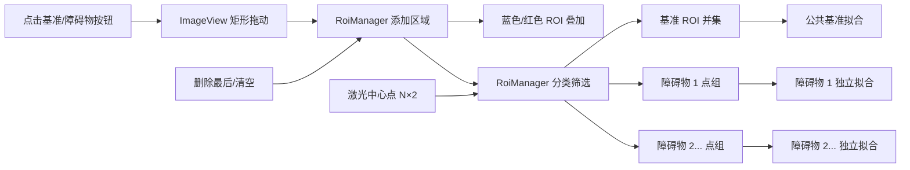

# ROI 交互与点筛选改动说明

## 图例

| 标记 | 含义 |
| --- | --- |
| 蓝色矩形 | 基准区域 |
| 红色矩形 | 障碍物区域 |
| 绿色点 | 全部激光中心点 |
| `baseline_points` | 所有基准 ROI 内中心点的并集 |
| `obstacle_points` | 所有障碍物 ROI 内中心点的并集，仅用于统一显示 |
| `obstacle_point_groups` | 各障碍物 ROI 的独立中心点数组，按添加顺序测量 |

## 主要改动

- 点击区域按钮后在图像中左键拖出矩形，完成后自动恢复平移模式。
- 支持添加任意多个基准/障碍物区域，并按添加顺序删除最后一个区域或全部清空。
- ROI 管理由无 Qt 依赖的 `RoiManager` 完成，GUI 只负责采集和绘制矩形。
- 每次 ROI 或激光中心变化都会刷新公共基准点和各障碍物独立点组。
- 多个基准 ROI 取并集后共同拟合；多个障碍物 ROI 分别拟合，不再跨框连线。
- 红框按添加顺序显示“障碍物 1、2…”，结果面板和输出文件使用相同编号。
- 障碍物 ROI 重叠时，重叠点会分别进入对应的两个点组。
- 新图像会清空上一张图像的 ROI 和测量结果。

## 坐标约定

ROI 使用图像像素边界坐标。激光中心采用 OpenCV 亚像素坐标，因此筛选时以 `(u + 0.5, v + 0.5)` 与矩形边界比较，和界面叠加位置保持一致。

## 代码流程图

